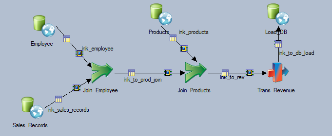
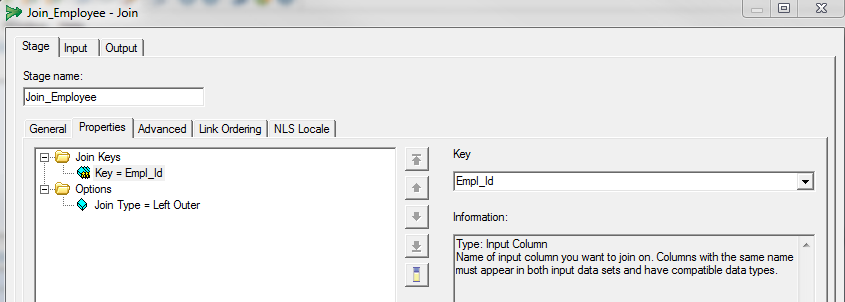

import { StaticImage } from "gatsby-plugin-image";
import { PostLayout } from "../components/PostLayout";

export default ({ children, pageContext }) => (
  <PostLayout pageContext={pageContext}>{children}</PostLayout>
);

# Hello World - First Blog

this is my first blog

<StaticImage
  src="../images/test/DataStage_Join_1.PNG"
  alt="datastage-lookup"
  placeholder="dominantColor"
/>
