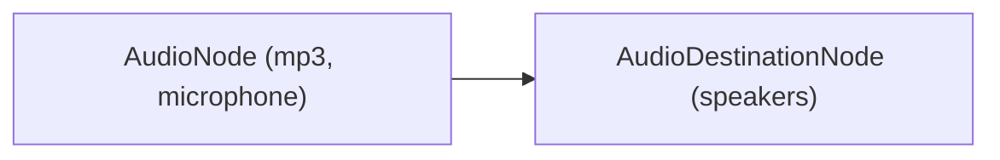
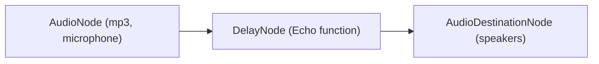
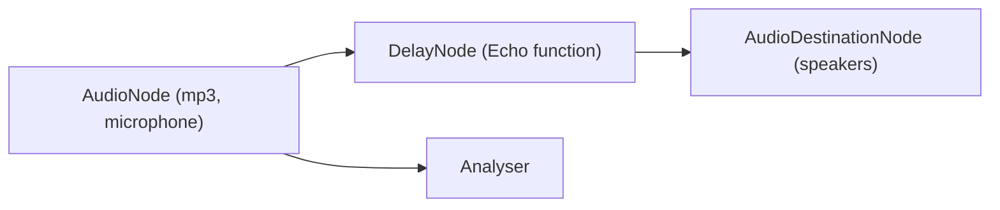
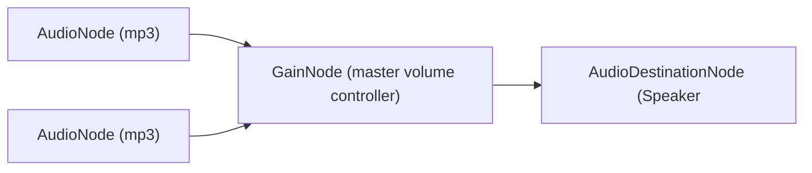

# Web Audio Learning

Learning Web Audio and Graphics from the frontend master course, [Web Audio Synthesis & Visualization](https://frontendmasters.com/courses/web-audio). The accompanying repo is [here](https://github.com/mattdesl/workshop-web-audio).

**APIs**

- [AudioContext](https://developer.mozilla.org/en-US/docs/Web/API/AudioContext)

## Get Started

```bash
yarn install
yarn start
```

## Note

`live-server@1.2.2` is broken. For now, we need to use `1.2.1`

# Web Audio API

## (1) Input/Output

**1-1 Input/Output basic**

We have a input, which is described as `AudioNode` (e.g. Microphone, MP3 file, and so on). Then, we wire it to `AudioDestinationNode`



[Example]('src/01-play-mp3-stream.js')

```js
audioContext = new AudioContext()
audio = document.createElement('audio')
... // get source, play audio etc...

// Create an Audio source node. Take the audio element as an argument.
const source = audioContext.createMediaElementSource(audio)
// Connect to the destination, which is a speaker
source.connect(audioContext.destination)
```

**1-2 Effect**

we can add other nodes (e.g. `DelayNode`) to process the audio between `AudioNode` and `AudioDestinationNode`.



**1-3 Analyser**



**1-4 Combining input**



## (2) Audio Playing

There are 2 ways to load and play audio, (1) Streaming and (2) Buffering. Streaming should be used for a large audio file while buffering for a small file. Buffering takes the entire audio file into the memory and play it from there.

- [Streaming code]('src/01-play-mp3-stream.js')
- [Buffering code]('src/02-play-mp3-buffer.js')

# Visualising Audio

Waveform

`analyserNode.getFloatTImeDomainData()`

We get the array of audio in the window. The start of the window is called `playhead` and have a small section of the audio.

`getFloatTimeDomainData(dataArray)` - data array from the start of window (playhead) to the end of the window.
